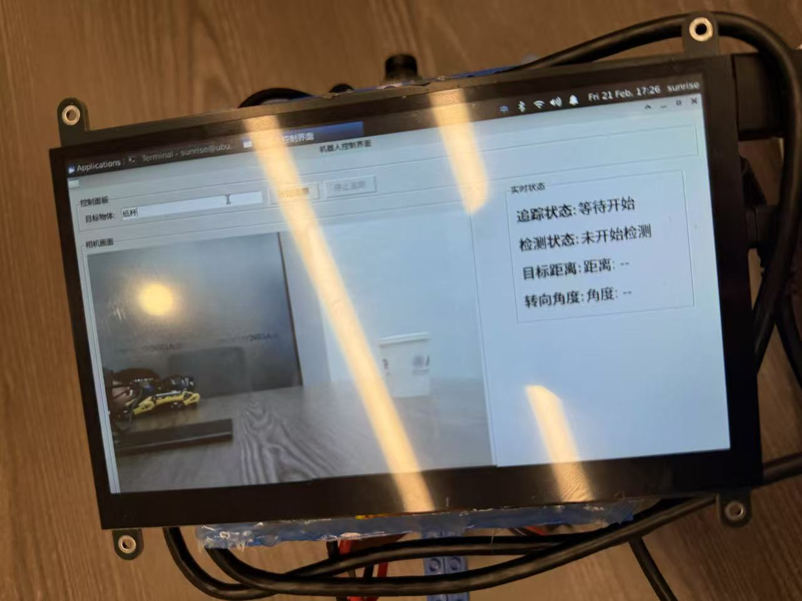

gitee:https://gitee.com/feng-xie-yi/vlm_car
# Readme
### 本demo积木小车使用飞特舵机和RDK X5
 **舵机初始使用部分** 
## 1 使用上位机配置舵机

 打开 FD.exe

 插入USB转串口，选择正确的COM号

设备管理器中应有 USB-SERIAL CH340 (COMx)，若连接好却找不到，请安装CH340驱动

 波特率选 1000000，打开串口

给舵机上电，点击舵机搜索

扫描到全部已连接舵机即可手动停止

注意舵机出厂ID都为1，接入多个ID冲突的舵机会搜索不到

 点选第二页 “编程”

选中要设置的舵机

依次设置ID，不能重复，多个舵机建议按1、2、3……依次分配（注意要手动点击保存）

点击“中位校准”设置舵机中位（机械臂需装配好后让关节在所需零点处设置，底盘不用设置该项），后续发布topic时以该位置为位置控制的零点

## 节点使用

把 /scservo_ws 文件夹复制到 /home/sunrise/ 目录下

### 首次配置

首先安装 colcon，然后编译

```bash
sudo apt update
sudo apt install python3-colcon-common-extensions
cd scservo_ws/
colcon build
```


Terminal 1
```bash
cd scservo_ws/
source install/setup.bash
ros2 run scservo_driver scservo_node
```
也可以使用 `ros2 launch scservo_driver scservo_driver.launch.py`

Terminal 2 舵机测试脚本
```bash
cd scservo_ws/
python test_servo.py 
```

Terminal 3 查看反馈数据（若需要）
```bash
ros2 topic echo /joint_states
```

Terminal 4 查看报错信息（若需要）
```bash
ros2 topic echo /servo_status
```
### 关于舵机节点，更详细的说明请看 [node.md](node.md)


### 项目两部分：1.舵机控制节点 2.VLM摄像头GUI互动传输指令部分 
###  **复现部分** 
0.API可自行选择调用，也可本地部署
### 如使用我们的相同模型，请自行配置好qwen的api
### 如调用API请根据自己的使用场景修改 get_vision_command 函数中的"content"

## 1.工作空间WS下编译

```
cd vlm_car/vlm_car_ws
colcon build
```

## 2.激活环境

```
source install/setup.bash

```
## 3.打开舵机控制节点

```
ros2 run scservo_driver scservo_node
```
## 4.打开VLM目标追踪功能节点

```
ros2 run scservo_driver track_to_obj_v4
```

GUI打开后，在窗口输入即可开始目标追踪

